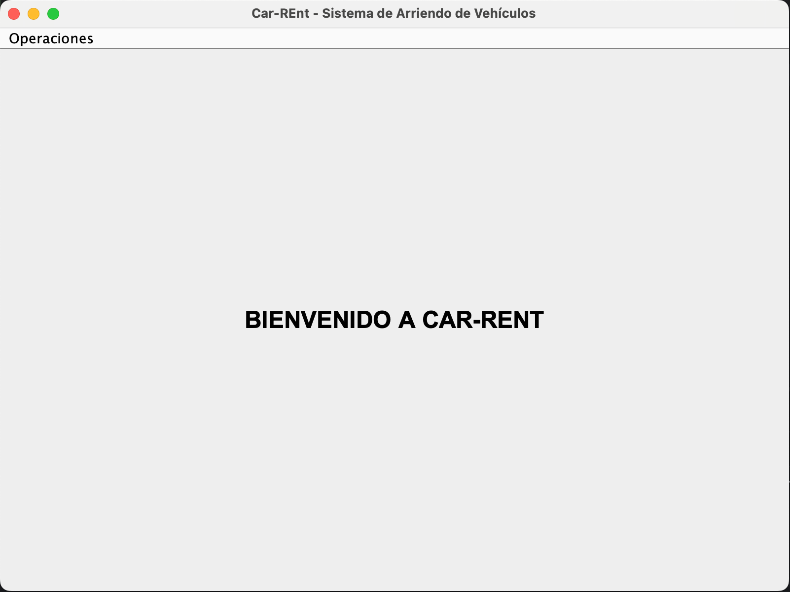
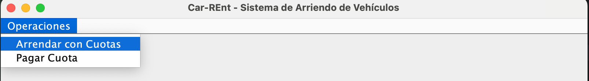
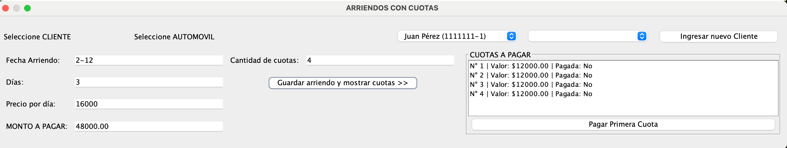
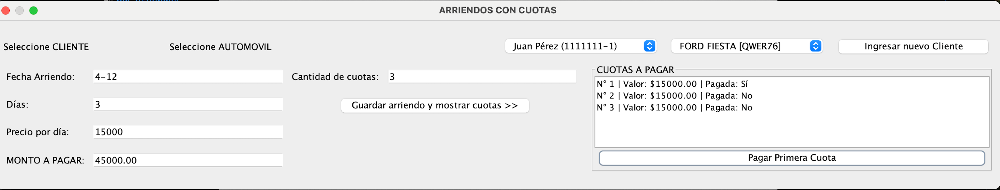
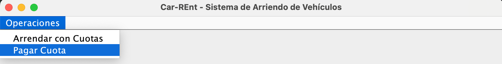
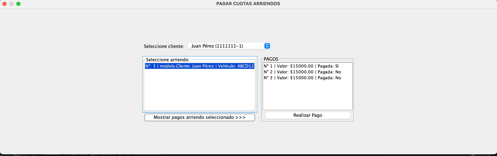
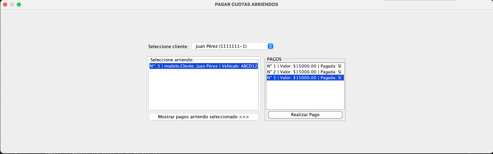

Application made with INTELLIJ IDEA CE using JDK 25 

HOW TO OPERATE-COMO HACER FUNCIONAR
1.Ejecutar main/Run main

2.Elegir primera alternativa para registrar/Choose first alternative to register

3.Completar siguiendo el formato/Complete according to the format in the sample

4.Pagar primera cuota haciendo click en el boton para pagar/Make first payment clicking on the button

5.Para pagar el resto de cuotas, seleccionar la otra opción/ To make the rest of payments, choose the second option

6.Click en "Mostrar pagos arriendo seleccionado"/Click on "Mostrar pagos arriendo seleccionado"

7.Completar el resto de pagos haciendo click en "Realizar pago"/Make the other payments clicking on "Realizar pagos".

